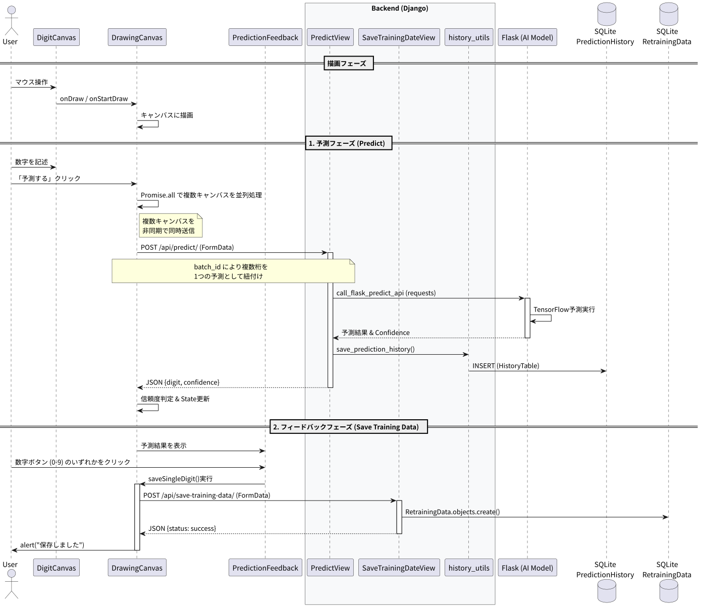

# 予測ページ機能 詳細設計書

## 機能概要
ユーザーが手書き数字を入力して、手書き数字をテキスト予測するページ。


## 接続先
### Django API（http://localhost:8000 ローカル開発時）
- PredictView.post（/api/predict（画像の数字予測））
- SaveTrainingDateView.post（/api/history/retraining_data/(再学習用の結果記録)）
### Flask API：
- http://localhost:5000（ローカル開発時）
- http://localhost:5001
- Django から HTTP 通信で呼び出される推論専用API
### DB
- PredictionHistory（予測履歴保存）
- RetrainingData（結果格納（再学習用））


## 処理フロー
### 1. React 側
 1. ***キャンバス入力***
    - 28×28 ピクセルの描画用キャンバスを 2 枚（leftCanvasRef / rightCanvasRef）用意。
    - 各キャンバスは白背景で初期化される。
    - 描画中の状態は isDrawing で管理
    - 描画中は状態フラグを保持し、線を描画する処理を行う。
2. ***描画データの取得***
    - 「予測する」ボタン押下時に、各キャンバスの画像データを取得。
3. ***共通ID (batchId) の生成***
    - 複数桁の数字を同一処理として識別するために、crypto.randomUUID() で生成
4. ***空キャンバス判定***
    - isCanvasEmpty(canvas) でキャンバスが空白かを判定
    - 空の場合は処理をスキップ
5. ***PNG Blob への変換***
    - 各キャンバスの内容を canvas.toBlob("image/png") で PNG形式のバイナリデータ に変換
6. ***Django API への送信***
    - 下記FormData を作成し送信
        ```
        formData.append("image", blob, "digit.png")
        formData.append("batch_id", batchId)
        formData.append("digitIndex", index.toString())
        ```
7. ***予測結果の受信***
    - 下記返却 JSON を受け取り
        ```
        { digit: string, confidence: number|string }
        ```
    - 信頼度 < settings.confidenceThreshold(設定した信頼度下限) の場合は破棄
8. ***後続処理***
    - 予測結果と canvas.toDataURL() をステートに保存


### 2. Django 側
1. ***Reactから受信***
    - /api/predict/ に POST で multipart/form-data 受信
        - image → 画像ファイル
        - batch_id → 共通ID
        - digitIndex → 桁位置

2. ***バリデーション***
    - 下記チェックを行う。
        - 画像の有無
        - batch_id と digitIndex が有効か

3. ***Flask API へ画像転送***
    - Django は、推論処理を担当する Docker コンテナ上の Flask API に対して HTTP リクエストを送信し、推論結果を受信する。
    - 送信内容
    ```
    requests.post(api_url, files={'image': image})
    ```

4. ***Flask からの返却***
    - 返却内容
        - predicted_class:予測結果
        - confidence:予測値の確率
        ```
        { predicted_class: int, confidence: float }
        ```

5. ***SQLite に保存 (PredictionHistory)***
    - 履歴保存用のDBへ結果を1桁ずつ保存
    ```
    batch_id, digit_index, predicted_class, confidence
    ```

6. ***React に返却***
    - Flask からの返却データ一を JSON 形式で返却する


### 3. Docker コンテナ上で稼働する Flask 推論API

1. 画像ファイルを受け取る

2. 前処理
    - 下記処理を行う
        - 28x28 リサイズ
        - グレースケール
        - 色反転、正規化

3. モデルで推論
    - Django 側で有効化されている AIModelConfig に基づき、<br>対応する Flask 推論API（モデルごとに起動されたコンテナ）へリクエストを送信する。
    - Flask 側では、起動時にロードされた TensorFlow モデルを用いて推論を行う。
    ```
    pred_class = argmax(preds)
    confidence = max(preds)
    ```
4. JSON で返却

## シーケンス図

