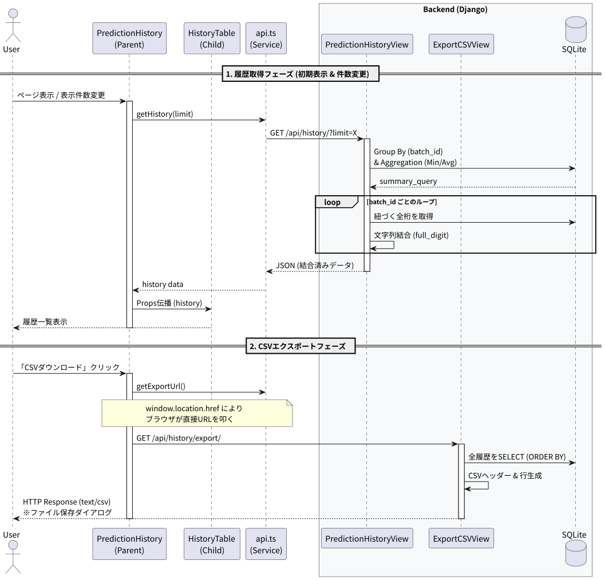

# 予測結果履歴ページ機能 詳細設計書

## 機能概要
予測処理により生成された、予測結果の履歴を一覧表示するページ。<br>
ユーザーは表示件数を選択でき、また履歴データをCSV形式でエクスポートできる。

## 接続先
### Django API（http://localhost:8000 ローカル開発時）
- PredictionHistoryView.get（/api/history/?limit={表示件数}（一覧表示するレコードを全行取得））
- ExportCSVView.get（/api/history/export/ (生データをCSVで出力する)）

### DB
- PredictionHistory（予測履歴保存）
- RetrainingData (再学習のための結果保存)


## 処理フロー
### 1. React 側
 1. ***一覧表示の準備***
    - コンポーネント初期化時に表示件数（limit）の初期値として10件を設定
    - 初期表示時はデータ取得中であることを示すため、loading フラグを true に設定
    - useEffect により履歴取得処理を実行

2. ***Django APIから履歴を取得***
    - 表示件数（limit）をクエリパラメータとして Django API に送信し、履歴一覧を取得
        ```
        getHistory(limit)
        ```
    - 取得した履歴データを history に保存

3. ***データ取得完了処理***
    - 履歴データの取得が完了した後、loading フラグを false に変更

4. ***履歴一覧表示***
   - loading が false の場合、履歴一覧をテーブル形式で表示

5. ***表示件数変更時の再取得***
   - ユーザーが表示件数を変更した場合、limit を更新する
   - limit の変更をトリガーとして useEffect が再実行され、履歴データを再取得する

#### CSV出力処理
1. ユーザーが「CSV出力」ボタンを押下する
2. フロントエンドは、CSV出力用APIのURLを取得
```
getExportUrl()
```
3. ブラウザの遷移機能を利用して、CSV出力用APIへアクセスする
    - window.location.href を使用
4. Django API は履歴データをCSV形式で生成し、レスポンスとして返却する
5. ブラウザの標準動作により、CSVファイルがダウンロードされる

### 2. Django 側
1. ***Reactから受信***
    1. クエリパラメータ limit を取得
        - 指定がない場合はデフォルト値（10）を使用
    2. limit を整数型へ変換
        - 変換に失敗した場合は安全値として 10 を設定

2. ***履歴データ集計処理***
    1. prediction_history テーブルから batch_id 単位で下記集計を行う
        - batch_id ごとにグループ化
        - 各 batch_id における最小の予測日時（created_at）を取得
        - 信頼度（confidence）の平均値を算出
    2. 集計結果を予測日時の降順で並び替え、指定件数分を取得

3. ***表示用データ生成***
    1. 各 batch_id について以下の処理を行う
        - batch_id に紐づく全レコードを取得
        - digit_index 順に並び替え
        - 各桁の digit（予測値） を連結し、1つの予測結果文字列を生成
    2. フロントエンド向けのレスポンス形式に整形
        - 信頼度はパーセンテージ表記に変換
        - 日時は文字列形式に変換

4. ***React に返却***
    - 集計・整形済みの履歴データ一覧を JSON 形式で返却

#### CSV出力処理
1. ReactからCSV出力要求を受信
2. CSVレスポンス生成
    - CSVレスポンス用の HttpResponse を生成
        - Content-Type：text/csv
        - ファイル名にタイムスタンプを付与
    - CSVのヘッダ行（カラム名）を書き込む
3. データ出力処理
    - prediction_history テーブルから全レコードを取得
    - 作成日時の降順で並び替え
    - 各レコードを1行ずつCSVへ書き込む
4. レスポンス返却
    - CSVファイルとしてレスポンスを返却
    - ブラウザの標準動作によりダウンロードが行われる

## シーケンス図

